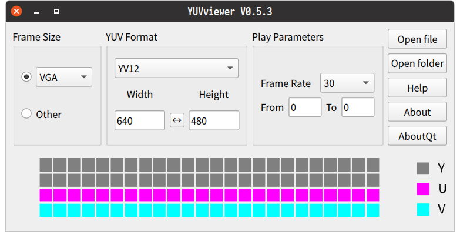

# YUVviewer

[English](./README.md) | 简体中文

YUVviewer一款用于开发人员查看预览各种原始图像格式的小工具，其基于Qt和opencv的框架，支持windows/linux/macos，界面简单清晰，操作便携，主界面如下：

## 功能描述

1. 主界面选择参数。
2. 点击打开文件或文件夹将进行图像数据解析并显示图像。
3. 图像显示界面中使用
    - 滚轮放大缩小图像，
    - 使用左键可拖动图像，
    - 双击左键导出图像为png格式或导出为其它RAW数据，
    - 单击右键复位图像大小和位置，
    - 双击右键交换图像R和B通道显示，
    - 单击中键显示图像原始大小。

## 格式支持

目前支持格式包括：

YV12、YU12/I420、NV21、NV12、YUY2/YUYV、YVYU、UYVY、YUV444、RGB565_L、RGB565_B、BGR565_L、BGR565_B、RGB888、BayerBG、BayerGB、BayerRG、BayerGR、BayerBG_RAW12、BayerGB_RAW12、BayerRG_RAW12、BayerGR_RAW12、PNG

## 编译说明

　> [编译说明](./DEVELOPNOTE.md)

## 贡献

如果您对本项目有建议或想法，欢迎在GitHub或Gitee上提交issue和pull requests。

目前项目已完全迁移至Qt6开发，建议使用版本Qt6.2.0或更高版本。
